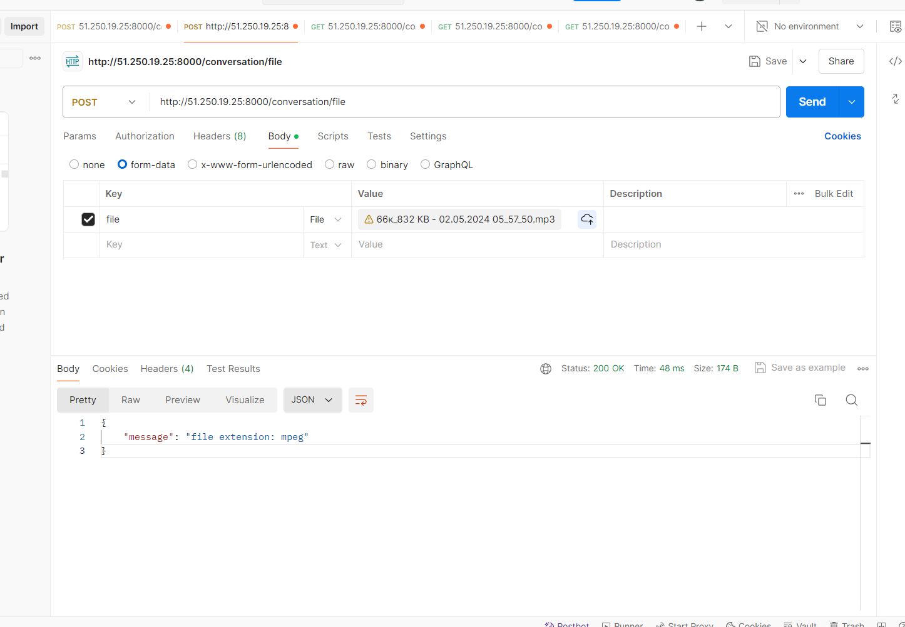

# Развертывание бэкенда и нейроной сети

Для того, чтобы развернуть бэкенд и нейронную сеть необходим docker и docker compose.
Нужно прописать файл docker-compose.yaml:

``` yaml
version: "3.9"

services:
  service:
    image: justnik8/hackathon-service # Образ бэкенд сервиса
    ports:
      - "8000:8000"
    environment:
      AI_HOST: ai_service # Хост сервиса с нейронной сетью
      AI_PORT: 5000 # Порт сервиса с нейронной сетью
      MINIO_SERVER_ACCESS_KEY: user # Имя пользователя minio (s3 хранилище)
      MINIO_SERVER_SECRET_KEY: pass # Пароль пользователя minio (s3 хранилище)
      MINIO_ENDPOINT: minio:9000 # Endpoint сервиса minio в формате 'хост:порт'
      MINIO_CONVERSATION_BUCKET: conversation # Название бакета для сохранения аудиозаписей
    depends_on:
      ai_service:
        condition: service_healthy
      minio:
        condition: service_healthy
      postgres:
        condition: service_healthy
    networks:
      - service_network

  ai_service:
    image: justnik8/hackathon-ai_service
    #build: ./conversation_ai
    ports:
      - "5000:5000"
      - "5001:5001"
    cpus: 0.7 # Максимальный процент утилизации процессора нейронной сетью
    healthcheck:
      test: [ "CMD", "curl", "-f", "http://localhost:5001" ]
      interval: 60s
      timeout: 60s
      retries: 10
    volumes:
      - ai_models_vol:/root/.cache/huggingface/hub  # Чтобы каждый раз не грузить модельку из интернета
    networks:
      - service_network
    deploy: # Использование видеокарты в докер контейнеры
      resources:
        reservations:
          devices:
            - driver: nvidia
              count: 1
              capabilities: [gpu]

  minio:
    image: 'bitnami/minio:latest'
    ports:
      - "9000:9000"
      - "9001:9001"
    environment:
      MINIO_ROOT_USER: "user" # Имя пользователя сервиса minio
      MINIO_ROOT_PASSWORD: "pass" # Пароль пользователя сервиса minio
    healthcheck:
      test: [ "CMD", "curl", "-f", "http://localhost:9000/minio/health/live" ]
      interval: 5s
      timeout: 5s
      retries: 10
    volumes:
      - minio_vol:/bitnami/minio/data
    networks:
      - service_network

  postgres:
    image: postgres:16-alpine
    environment:
      POSTGRES_DB: "conversations_db" # Имя базы банных
      POSTGRES_USER: "user"  # Имя имя пользователя базы банных
      POSTGRES_PASSWORD: "user" # Имя пароль пользователя базы банных
    ports:
      - "5440:5432"
    volumes:
      - pg_vol:/var/lib/postgresql/data
    networks:
      - service_network
    healthcheck:
      test: [ "CMD-SHELL", "pg_isready", "-d", "conversations_db" ]
      interval: 5s
      timeout: 5s
      retries: 10

volumes:
  minio_vol:
  pg_vol:
  ai_models_vol:

networks:
  service_network:
    driver: bridge

```

Далее: `docker compose up -d`

Демонстрация:
Загрузка файла:


